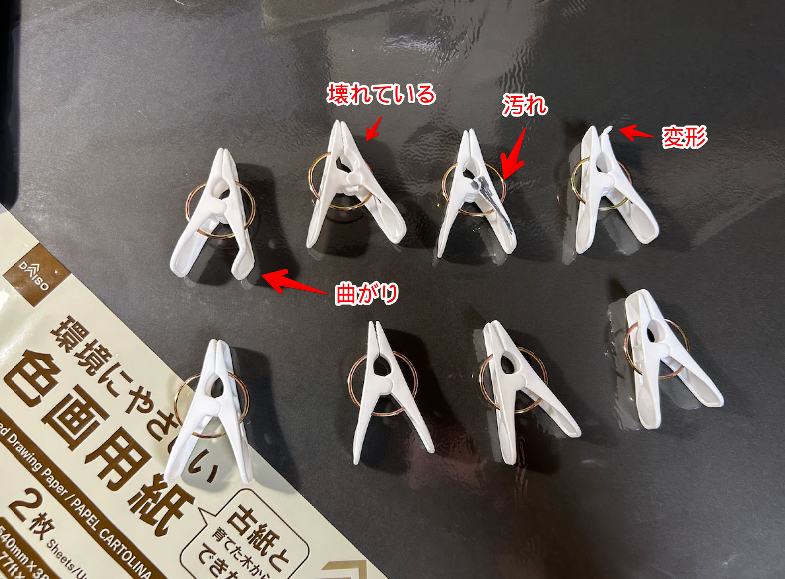
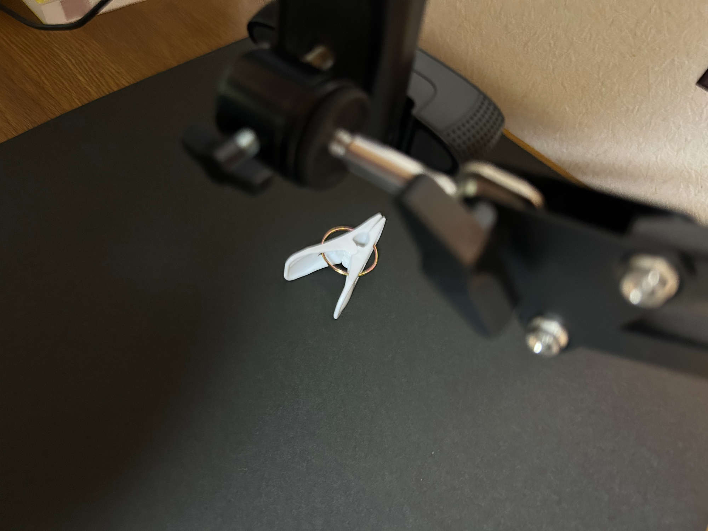
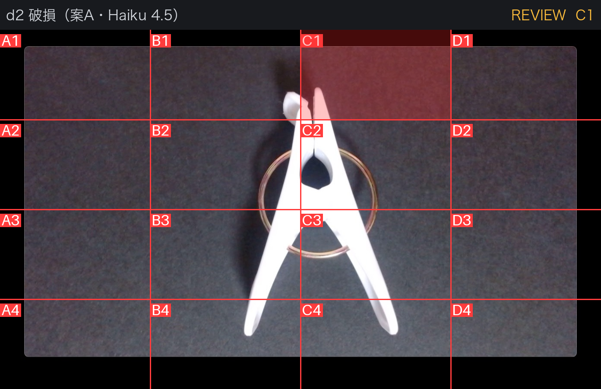
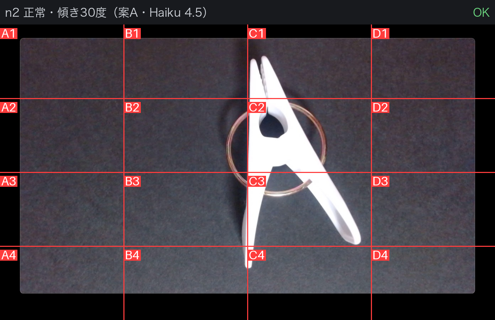
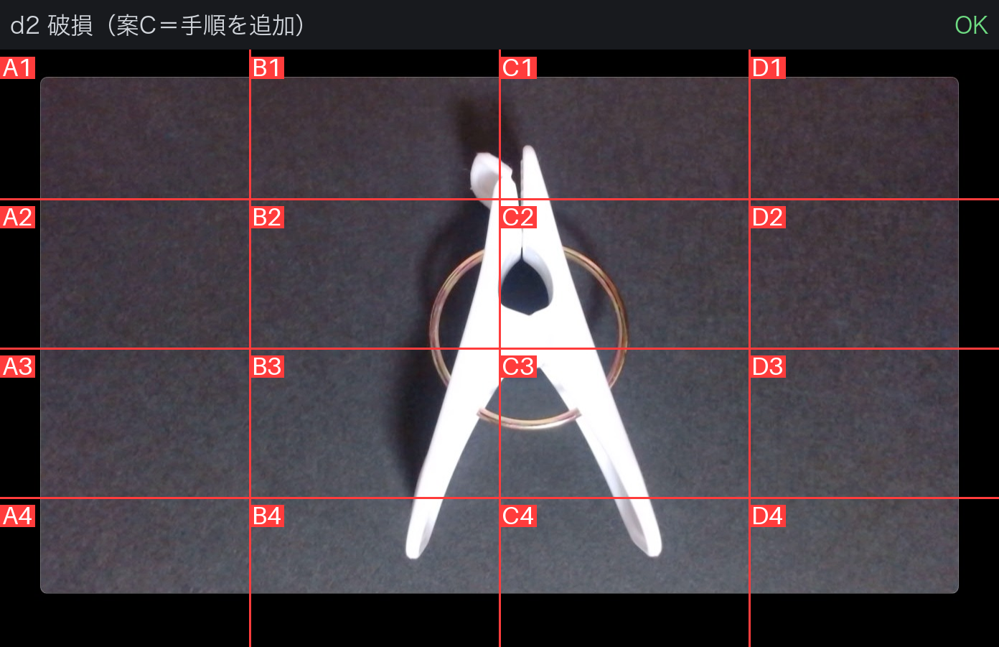

# bedrock-vlm-visual-inspection-clothespin

公開ベンチマークではなく、**100円ショップで買った洗濯ばさみ**で VLM 外観検査を試した記録です。
撮影した画像、生成された検査仕様、判定結果の JSON をすべて含んでいます。

[English](README.md)

---

## これは何か

[bedrock-vlm-visual-inspection-quickstart](https://github.com/furuya02/bedrock-vlm-visual-inspection-quickstart) を、
自分にとっても未知の対象に適用した検証です。前回の対象は NEU-DET（金属表面欠陥の公開データセット）でした。
ベンチマークとして整備されたデータなので、それ以外でも動くのかを確かめています。

検査対象は白い樹脂の射出成形品（洗濯ばさみ）です。同じ製品を 10 個買い、
正常 5 個と、自分で欠陥を作った 4 個を用意しました。



| 欠陥 | 性質 |
|---|---|
| `d1_stain` 汚れ | 表面欠陥 |
| `d2_broken` 壊れている | 形状異常（局所・破断面あり） |
| `d3_deformed` 変形 | 形状異常（全体） |
| `d4_bent` 曲がり | 形状異常（局所・破断面なし） |

Web カメラを真上に固定し、被写体だけを入れ替えて撮影しています。



正常品 5 個のうち 3 個（`n2` `n3` `n4`）は意図的に傾けて撮影し、
**検査仕様の生成には使っていません**。評価専用のホールドアウトです。
`n2` は約 30 度傾けています。

---

## 結果

### 検出と過検出

Claude Haiku 4.5 / 4×4 グリッド / 3 回多数決 / 参照画像として正常品を同梱。

| 個体 | 欠陥 | 判定 | セル |
|---|---|---|---|
| d1 | 汚れ | **REVIEW** | C3 |
| d2 | 壊れている | **REVIEW** | C1 |
| d3 | 変形 | OK（見逃し） | — |
| d4 | 曲がり | OK（見逃し） | — |
| n1〜n5 | 正常 | すべて OK | — |

```
過検出率              = 0 / 5 = 0%
検出率（REVIEW以上）  = 2 / 4 = 50%
処理時間              = 5.8〜8.7 秒/枚
JSON パース失敗       = 0 / 27 回
判定のばらつき        = なし（3 回とも同一）
検査仕様の生成        = 87.02 秒（Claude Opus 5 / in=10,611 out=5,187）
```



約 30 度傾けたホールドアウトでも過検出は出ませんでした。



### 境界線は「形状異常かどうか」ではなかった

事前の予想は「表面欠陥は検出でき、形状異常は難しい」でしたが、実測は違いました。

| | 結果 |
|---|---|
| 明確な破断面・高コントラストの付着物 | 検出できる |
| 破断面のない微妙な形状変化 | 検出できない |

`d2`（先端の破損）と `d4`（脚先端の曲がり）はどちらも形状の異常ですが、前者は検出し後者は逃しています。
差は **破断面という局所的な手がかりが画像に出ているか** でした。

### プロンプト 3 案の比較

形状異常を捉えるため、検査プロンプトを変えて 2 回試しました。**2 回とも悪化しています。**

| 案 | 具体的な欠陥記述 | 手順の指示 | 検出 | 過検出 | 判定の傾向 | 仕様ファイル |
|---|---|---|---|---|---|---|
| **A** | あり | なし | **2 / 4** | 0 / 5 | REVIEW | `results/spec_clothespin_4x4.json` |
| B | なし | あり | 0 / 4 | 0 / 5 | OK | `results/spec_clothespin_partB.json` |
| C | あり | あり | 0 / 4 | 0 / 5 | OK | `results/spec_clothespin_partC.json` |

案 B は手順を足す代わりに具体的な欠陥記述を落としてしまい、何も検出できなくなりました。
案 C は記述を残して手順だけ足しましたが、案 A で取れていたものまで落ちています。

案 C の出力を読むと、欠陥は見えているのに積極的に否定していました。

```json
"normal_observations": "C1セル上部に白い球状の物体が見えるが、これは照明由来の反射または
  カメラレンズの前方にある外部物体（ほこり、水滴など）と判断される。",
"overall_notes": "左右対称性、先端長、輪郭連続性、表面状態のすべての項目で正常基準を満たしている。",
"verdict": "OK"
```

同じ個体・同じモデルで、プロンプトだけが違います。



案 A の REVIEW（確信度 0.65）は、当初「NG を出し切れていない不完全な結果」に見えました。
しかし案 B・案 C では迷いが消えて OK と判定するようになり、その判断は誤りでした。
**REVIEW は不完全さではなく、確信が持てないものを人手確認へ回している状態**だったことになります。

### モデルを変えると何も検出できなくなった

検査仕様はそのままで、モデルだけ Nova 2 Lite に変えた結果です。

| | Claude Haiku 4.5 | Nova 2 Lite |
|---|---|---|
| 検出（REVIEW以上） | **2 / 4** | **0 / 4** |
| 入力トークン（1 枚・3 回計） | 20,766 | **7,536** |
| 出力トークン（1 枚・3 回計） | 1,848 | 1,406 |
| 処理時間 | 5.8〜8.7 秒/枚 | 2.3〜6.4 秒/枚 |
| JSON パース失敗 | 0 / 27 | 1 / 27 |
| コスト | ※単価未公開のため算出せず | **1.146 円/枚** |

前回は Nova 2 Lite で金属表面の傷を検出できていました。今回は同じモデルで何も取れません。
入力トークンが Haiku の 1/3 以下であることから、画像をより粗く扱っていると考えられます。

**検査対象によって必要なモデルのグレードが変わり、それがランニングコストに直結します。**

Nova 2 Lite の単価は AWS Pricing API の実値（ap-northeast-1）を使用しています。
Claude Haiku 4.5 は 2026 年 8 月時点で同 API の ap-northeast-1 に登録がないため、
推測値でのコスト算出は行っていません。

---

## quickstart からの変更点

コードの変更は 2 箇所だけです。

### 1. `scripts/bedrock.py` — read_timeout

botocore の既定の `read_timeout` は 60 秒ですが、検査仕様の生成には 87 秒かかりました。
既定のままだと `ReadTimeoutError` で落ちます。

```python
from botocore.config import Config

_BOTO_CONFIG = Config(connect_timeout=10, read_timeout=600,
                      retries={"max_attempts": 1, "mode": "standard"})
_client = boto3.client("bedrock-runtime", region_name=REGION, config=_BOTO_CONFIG)
```

リトライを 1 回に絞っているのは、タイムアウト時に裏で再実行されて課金が増えるのを避けるためです。

### 2. `scripts/generate_spec.py` — META_PROMPT

**この製品はバネで開閉する可動品です。** 2 本の脚の開き具合は正常品でも変わるため、
これを除外条件として書かないと、正常品を「変形」と誤判定するか、本物の変形を見逃します。

```
## この製品について（重要）

検査対象は白い樹脂製の洗濯ばさみ（射出成形品）です。次の 2 点に注意してください。

1. 表面の欠陥（汚れ・傷）だけでなく、形の異常（変形・曲がり・破損）も含みます。
   形の異常を判定するには「正常な形がどういうものか」の記述が不可欠です。

2. この製品はバネで開閉する可動品です。
   したがって 2 本の脚の開き具合は、正常品でも大きく変わります。
   開きが広い／狭いことは欠陥ではありません。
   判定すべきは「開き具合」ではなく、
   樹脂部品そのものが壊れている・歪んでいる・欠けているかです。
```

あわせて `normal_characteristics` に全体形状・対称性・部位の関係を記述させる指示と、
`inspection_prompt` の除外リスト（影・背景ノイズ・傾き・脚の開き具合・リングの見え方）を追加しています。

### 画像は JPEG に変換した

Web カメラのキャプチャをそのまま保存すると **PNG・RGBA・1 枚 1.4MB** になり、
6 枚渡すと送信ペイロードが約 8MB になります。JPEG(q92) に変換すると **約 137KB** になりました。

**画素数は下げていません**（1392×832 のまま）。Claude は長辺 1568px までしか使わないため、
形式を変えるだけで約 1/10 になります。

---

## 実行方法

### 準備

```bash
pip install -r scripts/requirements.txt
```

Amazon Bedrock で以下のモデルを有効化してください（リージョンは `ap-northeast-1`）。

- `global.anthropic.claude-opus-5`（検査仕様の生成）
- `jp.anthropic.claude-haiku-4-5-20251001-v1:0`（検査）
- `jp.amazon.nova-2-lite-v1:0`（検査・比較用）

### 検査仕様の生成

`n2` `n3` `n4` は渡しません（ホールドアウトのため）。

```bash
cd scripts
python3 generate_spec.py \
  --defect ../images/defect/d1_stain.jpg ../images/defect/d2_broken.jpg \
           ../images/defect/d3_deformed.jpg ../images/defect/d4_bent.jpg \
  --normal ../images/normal/n1.jpg ../images/normal/n5.jpg \
  --cols 4 --rows 4 --out spec_clothespin_4x4.json
```

### 判定

```bash
for f in d1_stain d2_broken d3_deformed d4_bent; do
  python3 inspect_image.py --spec spec_clothespin_4x4.json \
    --image "../images/defect/$f.jpg" --runs 3 --out "out/res_$f.json"
done

for f in n1 n2 n3 n4 n5; do
  python3 inspect_image.py --spec spec_clothespin_4x4.json \
    --image "../images/normal/$f.jpg" --runs 3 --out "out/res_$f.json"
done
```

モデルを変える場合は `--model jp.amazon.nova-2-lite-v1:0` を付けます。

生成済みの仕様と結果は `results/` に入れてあるので、実行せずに中身を確認することもできます。

---

## ディレクトリ構成

```
images/
├── normal/     正常品 5 枚（n2/n3/n4 は傾けたホールドアウト）
├── defect/     異常品 4 枚
└── setup/      撮影セットと検査対象一覧
results/
├── spec_clothespin_4x4.json    案A（本命）
├── spec_clothespin_partB.json  案B（手順のみ）
├── spec_clothespin_partC.json  案C（記述＋手順）
├── haiku/      案A × Claude Haiku 4.5 の判定結果
├── nova/       案A × Nova 2 Lite の判定結果
├── partB/      案B の判定結果
├── partC/      案C の判定結果
├── grid/       グリッドを焼き込んだ検査画像
└── annotated/  判定結果を重ねた画像
scripts/        quickstart から 2 箇所を変更したもの
```

---

## 関連記事

- [[Amazon Bedrock] 100均の洗濯ばさみで外観検査AIを試したら「正常の定義」でつまずきました](https://dev.classmethod.jp/articles/)
- [[Amazon Bedrock] 検査プロンプトを VLM 自身に書かせて外観検査をしてみました](https://dev.classmethod.jp/articles/bedrock-vlm-visual-inspection-generated-prompt/)
- [[Amazon Bedrock] Nova 2 Lite で金属部品の欠陥検出（外観検査）を試してみました](https://dev.classmethod.jp/articles/bedrock-nova-2-lite-metal-defect-detection/)

## ライセンス

MIT License

画像はすべて自分で撮影したものです（市販の洗濯ばさみ・欠陥は自作）。
